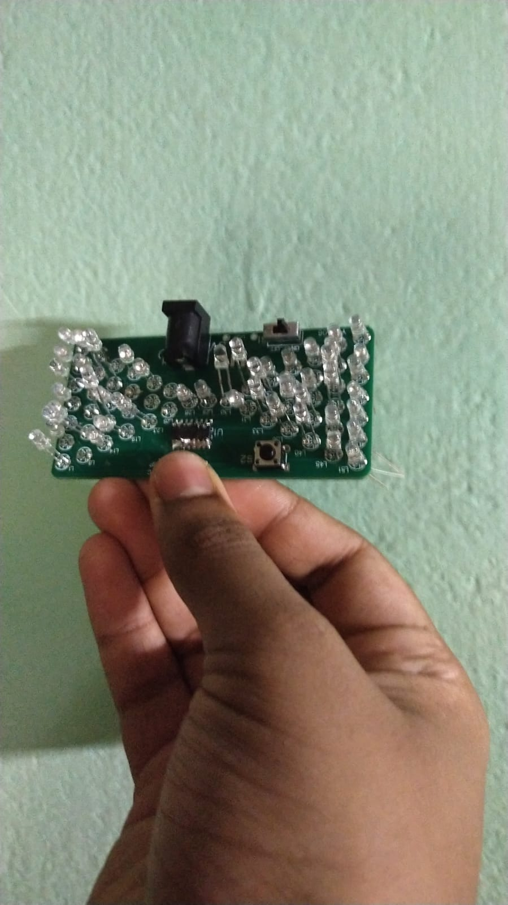
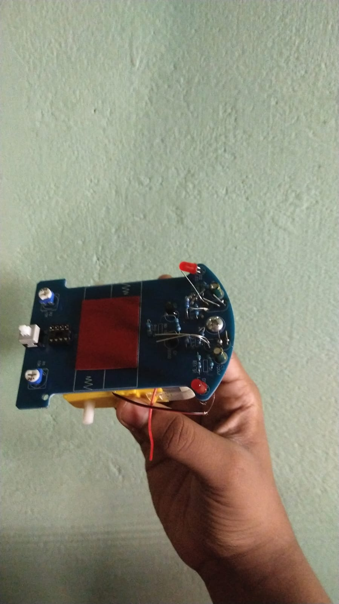

# kochi-blueprint-build-guild

Repo for submitting projects which I made during kochi blueprint build guild 

# Description

I kinda couldnt make them work completely because of the time constraint and also because of my limited soldering skills, but made 2 projects in total and both are based on pre-made pcbs. One are some fire led lights which are really hard to solder. The second one is a cool line following robot.

# Steps 

We used the sets given by the orgs for both the projects. For the lights I was able to follow the manual but for the line follower the schematics given were really hard to read so I had to follow a youtube video which I found. 

# Bill Of Materials 

<table>
  <thead>
    <tr>
      <th>Item</th>
      <th>Price</th>
    </tr>
  </thead>
  <tbody>
    <tr>
      <td>LED DIY KIT</td>
      <td>$1.98</td>
    </tr>
    <tr>
      <td>TRACING CAR KIT</td>
      <td>$2.50</td>
    </tr>
  </tbody>
</table>

# Images 

 
